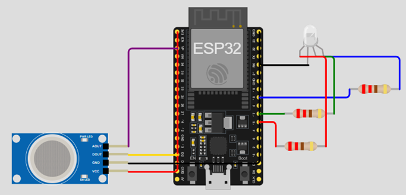

# IOT-SENSOR-QUALIDADE-AR
Repositório de desenvolvimento do software embarcado no projeto desenvolvido para a disciplina Objetos Inteligentes Conectados da Universidade Presbiteriana Mackenzie.

`Ana Clara Chromeck da Silva RA - 10423630`

## Descrição

O projeto foi desenvolvido na plafatorma Wokwi, e está disponível no link: //https://wokwi.com/projects/446100233451546625

A figura abaixo demonstra o sistema, contendo um micro-controlador ESP32, um sensor MQ135 (selecionar MQ2 na plataforma) e um LED RGB. O arquivo `controller.ino` contém a programação para o micro-controlador.

Conectar os itens nos pinos corretos garante o funcionamento do sistema. A tabela abaixo apresenta as conexões entre o sensor e o ESP32:

| Pino MQ135 | Pino ESP32 (nº da porta/representação no simulador) | Cor      |
| ---------- | --------------------------------------------------- | -------- |
| AOUT       | 36/VP                                               | Roxo     |
| DOUT       | 2/D2                                                | Amarelo  |
| GND        | GND                                                 | Preto    |
| VCC        | 3V3                                                 | Vermelho |

A tabela abaixo representa as conexões entre o LED e o ESP32:

| Pino LED RGB             | Pino ESP32 | Cor      |
| ------------------------ | ---------- | -------- |
| R                        | 16         | Vermelho |
| COM (setado como cátodo) | GND        | Preto    |
| G                        | 17         | Verde    |
| B                        | 18         | Azul     |

Além do feedback visual gerado pelo LED, o micro-controlador envia as informações coletadas via Broker MQTT. O fluxograma a seguir representa as etapas de comunicação do micro-controlador com o Broker:

